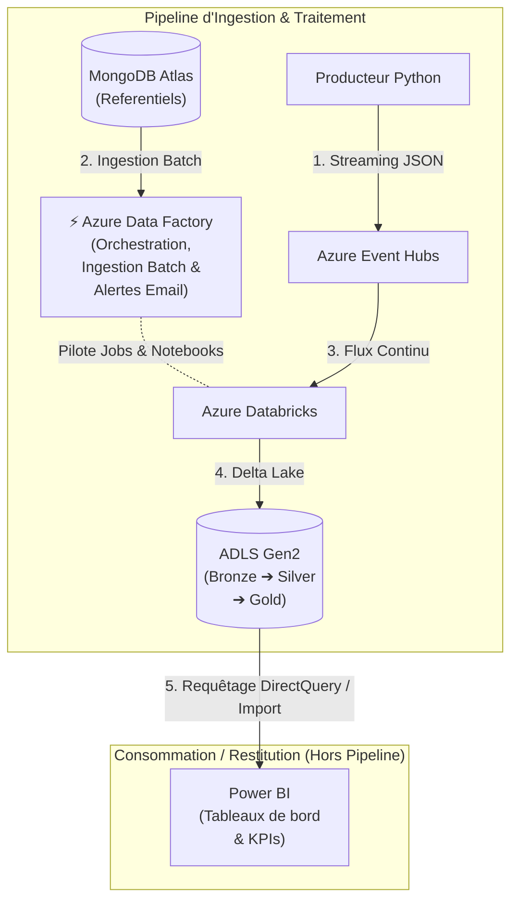

# 🚀 StreamVault — Pipeline Big Data Analytics (Jalon 3)

Ce dépôt contient l'architecture et les scripts du pipeline de données **StreamVault**, conçu sur Microsoft Azure. La solution combine du traitement en streaming temps réel et du batch pour alimenter un Data Lake structuré (Delta Lake) et restituer des indicator clés (KPIs).

---

## 🏗️ Architecture Globale

Le pipeline s'articule autour des composants principaux suivants :

* **Ingestion Temps Réel (Streaming) :** Script Python générant des événements JSON vers **Azure Event Hubs**.
* **Ingestion Batch & Orchestration :** **Azure Data Factory (ADF)** ordonnance l'extraction des référentiels **MongoDB Atlas**, exécute les notebooks Databricks et gère les alertes e-mail en cas d'erreur.
* **Traitement & Transformation :** **Azure Databricks (Spark Engine)** pour le nettoyage, la déduplication et l'agrégation des données.
* **Stockage Analytique :** **ADLS Gen2** structuré selon le modèle Médaillon (Bronze -> Silver -> Gold) au format Delta Lake.
* **Restitution & Analytics :** **Power BI** connecté à la couche Gold pour la visualisation des tableaux de bord.




## 🔒 Sécurité & Résilience

* **Gestion des Secrets :** **Azure Key Vault** centralise l'ensemble des clés d'accès et chaînes de connexion.
* **Contrôle d'Accès :** Utilisation systématique des **Managed Identities** Azure avec rôles RBAC stricts.
* **Chiffrement :** Flux sécurisés en **TLS 1.2+** en transit (AMQP-S, HTTPS).
* **Tolérance aux pannes :** Garantie *Exactly-Once* assurée par le checkpointing Spark et la rétention d'événements sur Event Hubs. Rétention des versions (*Soft Delete*) activée sur ADLS Gen2.

---

## 📁 Structure du Dépôt

```text

├── adf/                # Pipelines et activités JSON Azure Data Factory
├── databricks/         # Notebooks PySpark (Ingestion, Nettoyage, Gold)
├── producer/           # Script Python de simulation de flux streaming
├── docs/               # Architecture, schémas et rapports techniques
└── README.md
```

---

## 🛠️ Prérequis & Déploiement

1. Un abonnement **Microsoft Azure** actif.
2. Un cluster **Azure Databricks** configuré avec accès à **ADLS Gen2** via Identité Administrée.
3. Une instance **MongoDB Atlas** configurée avec accès réseau autorisé.
4. Python 3.9+ pour exécuter le script producteur local.
